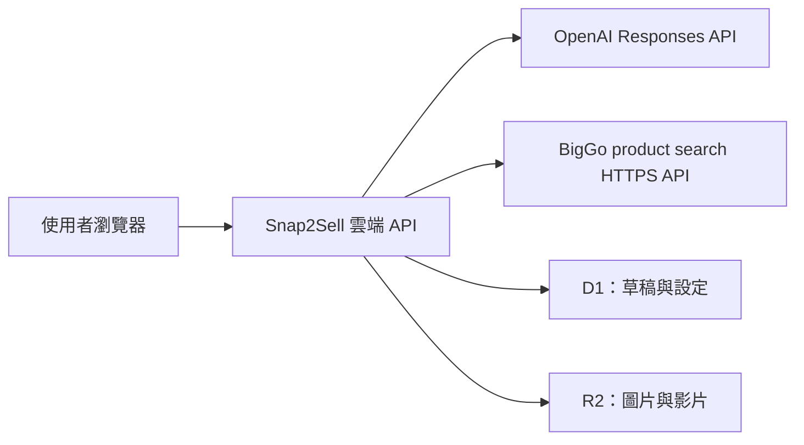

# Snap2Sell

繁體中文商品草稿工作台，參考蝦皮賣家中心的操作流程。上傳照片後，系統透過 OpenAI 辨識商品，詢問必要的缺漏資訊，整理名稱、屬性與文案，再使用 BigGo 搜尋行情並提供三種售價建議。

正式網站：https://snap2sell-studio.che30000.chatgpt.site/

本專案目前用於受邀測試與草稿整理，尚未串接蝦皮正式上架 API。

## 執行位置與架構

| 服務 | 執行位置 | 用途 |
| --- | --- | --- |
| Snap2Sell 正式前端與 API | Sites 部署的 Cloudflare Workers | 正式網站與 `/api/*` |
| D1 / R2 | 雲端 | 草稿、設定、媒體 metadata / 圖片與影片 |
| Snap2Sell 本機開發版 | 開發者電腦，預設 `http://localhost:5173` | 開發與本機驗證 |
| 獨立 BigGo MCP 入口 | 另行部署的 Mac 服務，`http://127.0.0.1:9876` | MCP 測試；不在主站請求路徑中 |



主站直接呼叫 BigGo 搜尋服務，沒有經過 Mac 的 Python MCP 或 Cloudflare Tunnel。獨立 MCP 的啟動、停止或 `.env` 修改不影響正式主站。Tunnel 網址由獨立服務管理，不是本專案的正式部署網址。

## 商品處理流程

1. **上傳照片**：JPG、PNG、WebP，每張最多 5 MB，每件商品最多 9 張；上傳後自動分析所有商品照片。
2. **全螢幕進度**：上傳、辨識、問答整理及接續查價期間暫停背景操作，顯示目前階段。完成或出錯後解除鎖定。
3. **初步辨識**：取得名稱、品牌、型號、分類、可見屬性、證據與信心。一般辨識只填空白欄位，保留已有編輯；有依據但不確定的名稱會標示候選。
4. **必要問答**：最多三題，依 AI 結果及欄位缺漏詢問狀況、型號、手機容量等。支援自由文字與「不確定」，避免反覆追問。
5. **修正誤判**：使用「修正辨識結果／補充說明」可一次更正，不必逐題回答。最新修正經 OpenAI 整理後重建身分、屬性、文案，清除舊行情及售價，再重新查價。辨識完成後仍可從屬性區重新開啟。
6. **自動查價**：辨識或問答完成後立即查價；手動修改比價欄位後，停止輸入約 800 ms 會自動查詢。失敗時保留資料並提供重新查詢入口。
7. **選擇與儲存**：從三個名稱、三個描述與三個建議價格中選擇，仍可自行編輯，最後儲存或匯出通用 JSON 草稿。

照片不能證明真偽、保固、庫存或交易承諾。手機代數不確定時，程式會保留 iPhone 系列候選，不直接把猜測代數當成確定型號。一般辨識不會自動確認商品；「AI 整理文案」另有身分確認與問答完成的檢查。

## 表單與三版內容

表單包含基本資訊、屬性、商品描述、銷售資訊、運費、其他六區，搭配導覽、優化提示、預覽與儲存列。

- 分類下拉使用使用者提供的 HTML 清單：28 個大分類與部分電腦、列印機子分類，並非完整蝦皮分類資料庫。未提供的分類可自行輸入。
- 手機、耳機、鍵鼠、列印商品使用不同屬性欄位。未知類型顯示品牌、型號、顏色及已有資料；可選值支援自行填寫。
- 三個名稱版本：精簡辨識、規格重點、狀況優先。
- 三個描述版本：**精簡速讀**呈現重點、**完整規格**分區條列、**自然介紹**使用段落文字。已知瑕疵會保留。
- 名稱與描述候選由 `packages/listing/options.ts` 根據現有資料產生，是模板整理，**不會各自額外呼叫 OpenAI**；「AI 整理文案」按鈕才會另外呼叫生成 API。
- 影片限 MP4、30 MB；描述圖片最多 12 張。行銷圖片、描述圖片、影片與商品照片分別保存參照。
- GTIN、包裹尺寸、物流費、優惠、SKU 與預定上架時間可存入草稿。物流預設費用來自參考頁面，不代表平台即時費率。

## BigGo 搜尋與採計

搜尋介面依 [BigGo MCP Server 原始專案](https://github.com/Funmula-Corp/BigGo-MCP-Server) 的 product search 服務實作，使用 TW 地區。

- 搜尋詞由品牌、型號或名稱及容量組成，前後加雙引號，例如 `"Apple iPhone 17 256GB"`。
- 搜尋回傳最多保留 50 筆，保存查詢詞、時間、來源、價格、原始篩選原因與人工採計決定。
- 預設策略比對型號、版本、容量、商品狀況，排除配件、組合價、無效價格、幣別不符、多規格價格範圍與重複來源；另以 IQR 處理離群價格。
- 每筆價格旁有 **✓ 採計 / ✕ 排除**，預設沿用系統策略。使用者可覆寫型號、配件等策略判斷；手動採計的離群值不會再次被 IQR 排除。無效數字及非支援幣別不能手動採計。
- 調整後立即重算三個建議：排序後索引 `floor((n - 1) × 0.3 / 0.5 / 0.7)`，分別對應價格競爭、市場平衡、較高定價。
- 至少三筆可採計資料才產生建議。型號未確認時預設僅供參考；使用者明確勾選至少三筆後可依這些資料計算。
- 採計調整不直接覆蓋已填售價，可再點選建議套用。自動查價則會在售價空白且有建議時填入；手動填寫的價格會保留。
- 人工決定隨草稿保存；**重新查詢會重設該次搜尋的人工決定**。
- 商品超連結優先使用原始 URL 中解碼後的 `purl`，無有效 HTTP(S) 目的地時回退至原始連結。原始 URL 仍保留供去重與資料識別使用。

價格是來源標示的行情，不代表成交價、銷售速度或獲利。使用者手動採計會改變篩選結果，需要自行核對商品是否可比。

## 本機開發

需要 Node.js **22.13.0 以上**。技術組合為 React、Next.js App Router 結構、vinext / Vite、Cloudflare Workers、D1、R2、Zod 與 Drizzle。

在專案根目錄執行：

```sh
npm run install:ci
cp .env.example .env.local
```

編輯 `.env.local` 填入自己的設定，再建立輸出與初始化本機資料庫：

```sh
npm run build
node --import ./scripts/sites-env.mjs ./node_modules/wrangler/bin/wrangler.js d1 execute DB --local --config dist/server/wrangler.json --persist-to .wrangler/state --file drizzle/0000_glossy_whizzer.sql
npm run dev
```

上述 SQL 僅用於尚未初始化的本機資料庫。已有資料庫時先確認 migration 狀態，只套用缺少的 migration。不得修改已發布的 migration。

`npm run dev` 的 portable 執行模式使用 `http://localhost:5173`；以終端實際顯示的網址為準。`npm start` 是透過 Wrangler 本機執行已建置的 Worker，**不是發布正式站**。本機資料與模擬器狀態保存在 `.wrangler/state` 等忽略提交的目錄。

### 環境變數

| 名稱 | 用途 |
| --- | --- |
| `TEST_LOGIN_USERNAME` | 設為非空值即啟用共用測試登入模式 |
| `TEST_LOGIN_PASSWORD` | 測試登入密碼，必須與登入模式一起設定 |
| `TEST_SESSION_SECRET` | Session 簽章密鑰，至少 32 字元 |
| `OPENAI_API_KEY` | 共用模式下由後端使用的 OpenAI 金鑰 |
| `OPENAI_MODEL` | 共用模式的模型名稱；目前正式站設定為 `gpt-5.6-terra`（2026-09-12） |
| `CREDENTIAL_ENCRYPTION_KEY` | 個人金鑰加密使用，32 隨機 bytes 編碼成 64 位 hex 字串 |

`.env.example` 與程式在未指定模型時仍預設 `gpt-4.1-mini`；正式站模型由部署環境覆蓋。若本機也要使用 Terra，明確設定：

```dotenv
OPENAI_MODEL=gpt-5.6-terra
```

本機變數來自 `.env.local`，修改後重新啟動開發服務以確保載入。正式站變數存於 Sites，**不會隨本機 `.env.local` 或 Git push 自動同步**；須更新正式環境變數後重新部署已保存版本。

主站的 BigGo product search 不使用 BigGo client ID / secret。若另外執行 Python MCP 的其他功能，其 `.env`、client credentials 與 access token 屬於獨立服務設定。

不要提交或輸出真實 API key、測試密碼、Session secret 或資料庫備份。更換 `CREDENTIAL_ENCRYPTION_KEY` 前需處理既有加密資料，否則無法解密舊金鑰。

## 登入與資料隔離

**目前正式站使用共用測試登入**：公開載入登入頁，資料、圖片及 AI API 仍要求伺服器驗證的 HttpOnly 簽章 Cookie。共用 OpenAI 金鑰僅存在後端，測試者不能透過設定頁更換。

每次成功登入建立獨立的測試空間，Session 有效七天。重新整理維持同一空間；登出再登入建立新空間，並非依帳號找回先前草稿。需要保留的內容應先匯出。修改測試密碼會使既有 Session 失效。

未啟用測試登入時，程式使用 Sites 提供的身分，允許各使用者設定自己的金鑰；金鑰以 AES-256-GCM 加密後存入 D1。自行移植部署時不可直接信任外部可偽造的身分標頭。

草稿依 owner 隔離，媒體參照也會驗證歸屬。儲存使用樂觀版本檢查，衝突回傳 HTTP 409。切換商品暫存未儲存修改；跨裝置持久化需要按「儲存」。移除照片參照不會立即刪除 R2 物件。

## 模組分工

| 路徑 | 責任 |
| --- | --- |
| `app/` | 路由、頁面組合、全站樣式 |
| `apps/web/Editor.tsx` | 頁面框架、導覽、預覽 |
| `apps/web/useStudio.ts` | 草稿狀態、上傳、問答、自動查價流程 |
| `apps/web/components/` | 表單、問答、進度、候選卡片、行情及設定 UI |
| `apps/api/handler.ts` | HTTP 路由處理、授權、輸入驗證、儲存與操作協調 |
| `apps/api/openai.ts` | Analyze / clarify / generate 的 prompt、JSON Schema 與 OpenAI 呼叫 |
| `apps/api/test-auth.ts`、`secrets.ts`、`storage.ts` | 測試登入、金鑰加密、儲存介面 |
| `packages/contracts/` | 前後端共用 Zod 契約與型別 |
| `packages/product/` | 辨識套用、修正、追問、分類樹及商品屬性 |
| `packages/listing/` | 草稿文案、三版名稱與描述模板 |
| `packages/market/index.ts` | 比價規則、人工採計、統計、搜尋詞及連結處理 |
| `packages/market/biggo.ts` | BigGo 後端 HTTPS adapter |
| `packages/preferences/` | 偏好順序與修改學習 |
| `components/ui/` | 共用 UI primitives |
| `db/`、`drizzle/` | DB schema 與 migration |
| `tests/` | 領域測試與本機 HTTP 測試 |
| `scripts/` | 安裝、執行模式、建置及測試工具 |
| `fixtures/products/` | 測試參考資料；不會自動載入成展示商品 |

多人協作規則見 [docs/CONTRIBUTING.md](docs/CONTRIBUTING.md) 與 [AGENTS.md](AGENTS.md)。前端不得匯入後端金鑰、DB 或 BigGo adapter；領域模組不得匯入應用層。跨模組修改先確認共用契約。`.github/CODEOWNERS` 是待填入真實團隊帳號的範本，不代表已啟用審查強制規則。

## API 與 AI 設定入口

| 方法與路徑 | 功能 |
| --- | --- |
| `POST /api/login`、`POST /api/logout` | 測試登入與登出 |
| `GET /api/bootstrap` | 草稿、設定狀態與偏好 |
| `POST /api/upload`、`GET /api/images/:id` | 媒體上傳與讀取 |
| `POST /api/analyze` | 圖片辨識與必要問題 |
| `POST /api/clarify` | 整理使用者回答與修正 |
| `POST /api/market` | BigGo 搜尋與初始篩選 |
| `POST /api/generate` | 模板或 AI 文案生成 |
| `POST /api/save` | 保存草稿及版本檢查 |
| `POST /api/review` | 檢查缺漏欄位 |
| `GET /api/preferences`、`POST /api/preferences` | 偏好讀取與更新 |
| `POST /api/settings` | 個人模式金鑰與模型設定；共用模式禁止修改 |

OpenAI 使用 Responses API、`store:false`、嚴格 JSON Schema，回應上限 3,500 tokens，請求逾時 55 秒。模型能否完成回應仍受帳戶額度、模型權限與輸出長度影響；失敗不會自動改用假資料。

偏好順序為本次設定 > 賣場分類 > 賣場 > 使用者 > 預設。修改學習目前處理描述縮短、Emoji 增減、標題括號移除；需至少三件不同商品、80% 一致性及足夠累積權重，使用 30 天半衰期。三版描述模板不等同於完整個人化 AI 生成。

## 驗證與發布

```sh
npm run typecheck
npm test
npm run build
```

`npm test` 執行 `tests/domain.test.ts`，不呼叫外部 AI 或 BigGo。測試涵蓋商品辨識套用、修正、登入簽章、分類屬性、描述差異、比價篩選、人工採計、搜尋引號及 `purl` 等。

`python3 tests/integration.py` 是舊的 **Sites 本機身分模式** HTTP 測試，固定指向 localhost:5173 並使用本機模擬 Cookie；不能直接套用目前的共用測試登入模式，也不可指向正式站。若使用共用模式驗證，需先經 `/api/login` 取得 Cookie，再測試 owner 隔離、上傳、問答、保存及版本衝突。臨時人工驗證腳本位於忽略提交的 `work/`，不是可攜式測試套件。

正式部署由 Sites 管理，`.openai/hosting.json` 保存專案 ID 與 `DB` / `BUCKET` 綁定名稱。流程為：

1. 通過相關檢查並建置。
2. Commit、push 精確原始碼版本至 Sites source repository。
3. 使用 Sites packaging 工具打包該版本的建置輸出，保存 Site version。
4. 部署已保存版本，確認 deployment status 為 `succeeded`。
5. 環境變數更新也需要重新部署；保留目前公開登入頁及應用內驗證設定。

不用 `npm start` 或重啟 Mac MCP 來更新正式站。發布憑證不可寫入 Git remote URL 或提交檔案。

## 尚未實作與使用範圍

- 沒有蝦皮 OAuth、正式商品刊登、多規格庫存同步、真實促銷或物流操作。
- 預定上架時間只保存資料，不會排程發布。
- JSON 匯出是本專案的通用草稿格式，不是蝦皮批次匯入檔。
- 沒有獨立測試者帳號管理、共同店舖權限或即時多人共同編輯；開發協作以 Git 與模組界線為主。
- 分類樹與屬性選項是目前維護的參考資料，不是完整平台規格。
- 圖片、型號判定及外部行情仍需人工核對；手動採計可能納入原策略排除的資料。
