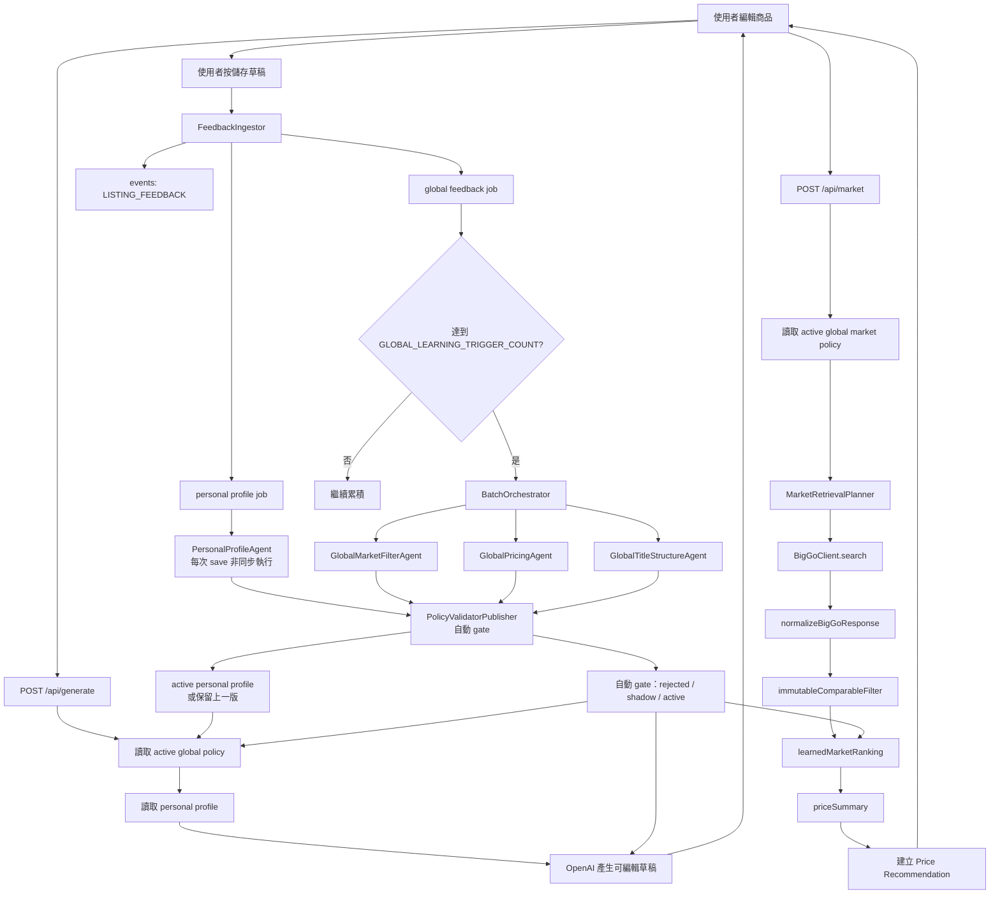

# Snap2Sell Agent Architecture

## 1. 目前規劃的角色總覽

目前規劃共 7 個角色，其中 4 個是 OpenAI 分析 Agent，3 個是系統服務。BigGo connector 是外部資料 adapter，不算 AI Agent。

| 角色 | 類型 | 是否呼叫 OpenAI | 主要責任 |
|---|---|---:|---|
| `FeedbackIngestor` | 系統服務 | 否 | 把使用者 save feedback 寫入 event 與 queue |
| `PersonalProfileAgent` | 個人化 Agent | 是 | 分析個人價格與描述風格 |
| `GlobalMarketFilterAgent` | 全域 Agent | 是 | 分析來源品質與 market filter |
| `GlobalPricingAgent` | 全域 Agent | 是 | 調整三種價格策略使用的 market percentile |
| `GlobalTitleStructureAgent` | 全域 Agent | 是 | 收斂標題結構與 title variants |
| `PolicyValidatorPublisher` | 系統服務 | 否 | 驗證、發布、shadow、rollback policy |
| `BatchOrchestrator` | 系統服務 | 否 | 消費 queue 並協調各 Agent |

BigGo 相關的 `BigGoClient`、normalizer、source identity resolver、market filter 與 summary 是資料處理模組，不是 AI Agent。

## 2. 系統流程圖



## 3. 各 Agent 任務

### 3.1 `FeedbackIngestor`

**定位：資料入口，不是 LLM Agent。**

**觸發時機：** 使用者呼叫 `POST /api/save` 且 draft 儲存成功。

**輸入：**

- 目前 draft。
- `generationId`。
- generated title／description。
- final title／description。
- `marketSnapshotId`。
- `priceRecommendationId`。
- final price 與選擇的 pricing strategy。

**任務：**

1. 驗證所有 ID 都屬於目前 owner 與 product。
2. 寫入 `LISTING_FEEDBACK` event。
3. 寫入 `PREFERENCE_OBSERVATION` event。
4. 同一個 event 建立兩種獨立工作：personal profile job 與 global feedback job。
5. personal job 在 save 成功後立即非同步執行；global job 留給 batch threshold。
6. 以 `dedupe_key` 防止同一個 event 的同一種工作重複入列。

**不負責：** 不判斷風格、不修改 policy、不呼叫 BigGo、不呼叫 OpenAI。

### 3.2 `PersonalProfileAgent`

**定位：分析單一使用者的價格與描述偏好。**

**觸發時機：** 每次使用者成功 save 後立即非同步執行，不需要累積筆數 threshold。為避免同一使用者的版本競爭，工作需依 owner 序列化，並檢查 `baseVersion`。

**輸入：**

- 該使用者上一版 personal profile。
- 最近多筆 generated/final description。
- 價格策略選擇與最終價格比例。
- 既有 evidence 與矛盾訊號。

**分析面向：**

- 描述長度。
- 語氣。
- Emoji。
- 規格細節。
- 行銷強度。
- 條列／段落結構。
- `profit_first`、`momentum_price`、`traffic_first` 的偏好。

**輸出：**

```json
{
  "profilePatch": {
    "length": "concise",
    "marketing": "low",
    "pricingGoal": "momentum_price"
  },
  "evidence": [
    {
      "dimension": "length",
      "value": "concise",
      "reasonCode": "final_description_shorter",
      "weight": 1
    }
  ],
  "confidence": 0.84,
  "contradictions": []
}
```

**限制：**

- 不修改商品事實。
- 不修改 global policy。
- 不把個人描述語氣套到標題。
- 只能使用允許的 enum。

**自動套用門檻：** PersonalProfileAgent 可以每次提出 proposal，但只有同時通過以下條件才會自動寫入新的 active personal profile：

- strict JSON Schema 與欄位白名單通過。
- proposal 的 owner、product 與 `baseVersion` 仍然有效。
- confidence 達到部署設定的 `PERSONAL_PROFILE_MIN_CONFIDENCE`。
- 沒有未解決的 contradiction，且單次變更維度數量不超過 `PERSONAL_PROFILE_MAX_DIMENSION_CHANGES`。
- 不修改商品事實、不越過 personal scope。

不通過時自動保留上一版 profile，記錄 rejected proposal 與原因，不等待人工判斷。

### 3.3 `GlobalMarketFilterAgent`

**定位：分析哪些市場來源與結果 filter 較有效。**

**觸發時機：** Global queue 達到 `GLOBAL_LEARNING_TRIGGER_COUNT`，且 batch 已建立 source/filter summary。

**輸入：** 聚合後資料，不直接吃所有使用者原始文字：

- source 出現數。
- 通過 immutable filter 的數量。
- 被納入 summary 的數量。
- 使用該次推薦後成功 save 的數量。
- 排除原因分布。
- 上一版 `marketFilterPolicy`。

**輸出：**

```json
{
  "marketFilterPatch": {
    "retrieval": {
      "sourcePriority": ["verified-source-a", "verified-source-b"],
      "queryHints": []
    },
    "ranking": {
      "sourceWeights": {"verified-source-a": 0.12},
      "softRanking": ["verified-source-a", "verified-source-b"]
    }
  },
  "confidence": 0.78,
  "reasonCodes": ["higher_acceptance_rate"]
}
```

**限制：**

- 不能停用型號、容量、商品狀況、幣別、價格有效性等 safety filter。
- 不能直接修改 BigGo query 或 raw response。
- 不能把 affiliate URL host 當成來源，除非 source identity 已確認。
- `retrieval` 欄位只能使用 BigGo connector 明確宣告支援的能力；不支援時由 planner 降級為結果回來後的 ranking。

### 3.4 `GlobalPricingAgent`

**定位：調整三種全域價格策略如何使用市場價格分布。**

**觸發時機：** Global batch 中有足夠的 pricing strategy 選擇與 final price feedback。

**輸入：**

- 客觀的 `summary.balanced` p50 與 IQR 排除後的有效價格分布。
- 每個策略的選擇率。
- final price 相對各 percentile 的位置。
- 使用者向上或向下手動修改的方向。
- 上一版 pricing policy。

**計算基準：**

```text
referenceMarketMedian = quantile(0.50)
recommendedPrice = quantile(strategy.percentile)
```

**三種策略：**

| 策略 | 商業目的 |
|---|---|
| `profit_first` | 利潤優先 |
| `momentum_price` | 成交動能價 |
| `traffic_first` | 流量優先 |

**輸出：**

```json
{
  "pricingPatch": {
    "profit_first": {"percentile": 0.75},
    "momentum_price": {"percentile": 0.50},
    "traffic_first": {"percentile": 0.25}
  },
  "confidence": 0.81,
  "reasonCodes": ["final_prices_below_recommendations"]
}
```

**限制：**

- 不修改客觀 `summary.balanced` p50。
- 不新增第四種策略。
- 不超過產品設定的 percentile 上下限、策略間最小間距與單次變更幅度。
- 資料只足以改 default/order 時，不調整 percentile。

### 3.5 `GlobalTitleStructureAgent`

**定位：標題 global 化，不做個人語氣化。**

**觸發時機：** Global batch 中，同一 `canonical_product_id` 有足夠 title feedback。

**輸入：**

- 商品 identity 的已確認事實。
- generated/final title variants。
- accepted／edited／shown 統計。
- 上一版 title structure policy。

**分析面向：**

- 品牌是否保留。
- 型號是否保留。
- 容量／版本是否保留。
- factual token 完整度。
- 標題長度。
- 分隔符號與結構。

**輸出：**

```json
{
  "titleStructurePatch": {
    "keepBrand": true,
    "keepModel": true,
    "includeConfirmedVariant": true,
    "maxLength": 80
  },
  "confidence": 0.8
}
```

**限制：**

- 不套用個人 tone、Emoji 或 description style。
- 不直接把其他賣家的完整標題展示給使用者。
- 第一階段只產生 shadow proposal，不立即取代正式標題。

### 3.6 `PolicyValidatorPublisher`

**定位：Policy 的安全閘門，不是 LLM。**

**觸發時機：** 任一 Agent 產生 proposal 後。

**檢查：**

- JSON Schema。
- 欄位是否在白名單內。
- confidence 是否達標。
- global proposal 是否有足夠樣本；personal proposal 不做筆數 threshold，但仍檢查事件有效性與 confidence。
- percentile 或 source weight 是否超過變更幅度。
- 是否關閉 immutable safety filter。
- 是否有其他 active batch。
- based-on version 是否仍是最新版本。

**結果：**

```text
rejected → candidate → shadow → active
```

這個角色是自動化 policy gate，不需要人工批准。只有它可以發布 active global policy 或 active personal profile。

**自動 gate：**

- schema、scope、base version 與 allowed dimensions 通過。
- confidence、樣本／事件覆蓋率與單次變更幅度達到設定值。
- 不會關閉 immutable factual filter。
- global market policy 的 retrieval 欄位符合 connector capability；不支援的欄位不得標示為已套用。
- global policy 先做離線 replay；需要 shadow 的策略在 shadow window 通過後自動 promote。
- 監測到品質退化時自動 rollback 到上一個 active version。

Personal profile 沒有筆數 threshold，但仍必須通過上述個人 scope、confidence、版本與安全檢查。

### 3.7 `BatchOrchestrator`

**定位：控制 queue 與 Agent 執行順序，不自行理解文字。**

**觸發時機：** global feedback job 的 queued 數量達到 `GLOBAL_LEARNING_TRIGGER_COUNT`。PersonalProfileAgent 不由這個 batch 觸發。

**任務：**

1. 取最早的一批 queue item。
2. 建立 batch snapshot。
3. 聚合 source、pricing、title 統計。
4. 依序呼叫 GlobalMarketFilter／GlobalPricing／GlobalTitleStructure Agent。
5. 收集各 Agent proposal。
6. 交給 `PolicyValidatorPublisher` 自動 gate。
7. 更新 queue item 與 batch 狀態。
8. 記錄版本、diff、錯誤與 retry。

## 4. BigGo Connector，不是 AI Agent

BigGo 建議解構成：

```text
讀取 active MarketFilterPolicy
  ↓
MarketRetrievalPlanner
  ↓
BigGoClient.search()
  ↓
normalizeBigGoResponse()
  ↓
resolveSourceIdentity()
  ↓
immutableComparableFilter()
  ↓
learnedMarketRanking()
  ↓
priceSummary()
```

`MarketRetrievalPlanner` 是 agent policy 與 BigGo connector 之間的邊界。它把 policy 轉成目前 connector 能理解的 `MarketRetrievalPlan`；agent 不直接呼叫 BigGo，也不直接改寫 raw request。若目前 BigGo 接口只支援 `query/site/region`，planner 就保留原 request，僅將 source ranking、quota 等支援的策略套在結果處理階段。

### 同事負責

- BigGo HTTP request。
- raw response schema。
- raw item 到 `NormalizedMarketItem` 的 mapping。
- 穩定 `sourceKey` 的確認。
- affiliate URL 與原始來源的辨識。

### 個人化系統負責

- `MarketFilterPolicy`。
- source weights 與 soft ranking。
- batch feedback aggregation。
- `GlobalMarketFilterAgent`。
- `GlobalPricingAgent`。

兩邊透過以下 contract 串接：

```ts
type NormalizedMarketItem = {
  title: string;
  price: number;
  currency: string;
  url: string;
  min: number | null;
  max: number | null;
  sourceKey?: string;
};

type MarketFilterPolicy = {
  version: string | null;
  retrieval?: {
    sourcePriority?: string[];
    sourceQuota?: Record<string, number>;
    queryHints?: string[];
  };
  sourceWeights: Record<string, number>;
  sourceAllowList: string[];
  sourceBlockList: string[];
  maxSourceShare: number | null;
};
```

## 5. Agent 觸發時機總表

| 時機 | 執行角色 | 條件 | 產物 |
|---|---|---|---|
| 使用者儲存草稿 | `FeedbackIngestor` | save 成功 | event + personal/global jobs |
| 每次 save 成功 | `PersonalProfileAgent` | 無筆數 threshold，非同步執行 | personal profile proposal |
| Global queue 達標 | `BatchOrchestrator` | `GLOBAL_LEARNING_TRIGGER_COUNT` | batch snapshot |
| Global source summary 完成 | `GlobalMarketFilterAgent` | 有效 source stats | market filter proposal |
| Global pricing summary 完成 | `GlobalPricingAgent` | 有足夠 strategy feedback | pricing percentile proposal |
| Product identity 有樣本 | `GlobalTitleStructureAgent` | 同 identity 有足夠 title feedback | title structure proposal |
| Agent proposal 完成 | `PolicyValidatorPublisher` | 自動 gate 通過 | active/shadow/rejected |
| 下一次 market/generate | market/generate API | 有 active policy | 套用最新版本 |

## 6. 自我迭代的定義

本系統的「自我迭代」不是 Agent 修改自己的程式碼，而是 Agent 持續更新版本化的 profile 與 policy。

```text
Observe
  ↓
Aggregate
  ↓
Analyze
  ↓
Propose
  ↓
Validate
  ↓
Shadow
  ↓
Activate
  ↓
Observe 下一輪結果
```

每次 Agent 執行都會拿到：

- 上一版 personal profile 或 global policy。
- 新增的 feedback batch。
- 已套用 policy 的 `policy_evaluations`，例如 filter 通過率、source coverage、價格選項與使用者修改方向。
- 允許修改的 dimensions。
- 本次變更的上限。

因此 Agent 不是重新從零判斷，而是提出 delta：

```text
previous policy + new evidence → policy proposal
```

### 6.1 個人迭代

- 每次 save 都會觸發一次非同步分析，不以累積筆數作為啟動條件。
- 只影響該使用者，主要更新 description style 與 pricing goal。
- Agent proposal 先經自動 gate；confidence、版本、scope 或安全條件不通過時保留上一版 profile。
- 通過後系統自動建立新的 personal profile version，下一次 `generate` 立即讀取。

### 6.2 全域迭代

- 只在 global queue threshold 達成後執行。
- 來源 filter、價格 percentile、標題結構分開產生 proposal。
- 任一 Agent 失敗，不應阻塞其他已通過驗證的 proposal。
- global policy 由 validator 自動通過 candidate／shadow gate 後 active，不需要人工批准。
- 下一個 batch 會把 active／shadow policy 的 evaluation 回饋給對應 Agent；新版效果不佳時由 validator 自動回滾到上一版。

### 6.3 不允許的自我迭代

- Agent 不能修改自己的 prompt、程式碼或 schema。
- Agent 不能繞過 validator 直接寫 active policy；validator 會自動決定是否套用。
- Agent 不能改寫 BigGo raw response。
- Agent 不能把未確認商品資訊變成事實。
- Agent 不能因單一使用者事件改變全域策略。

## 7. OpenAI 接入方式

目前不需要導入獨立 Agent SDK。沿用現有 `apps/api/openai.ts` 的 Responses API adapter，新增：

```text
apps/api/learning-agent.ts
apps/api/learning-orchestrator.ts
packages/contracts/learning.ts
```

每個 OpenAI Agent 必須：

- 使用 `store:false`。
- 使用 strict JSON Schema。
- 只接收自己責任範圍的資料。
- 只輸出 proposal，不直接執行 SQL 或 API action。
- 失敗時由 deterministic fallback 保留上一版 policy。
